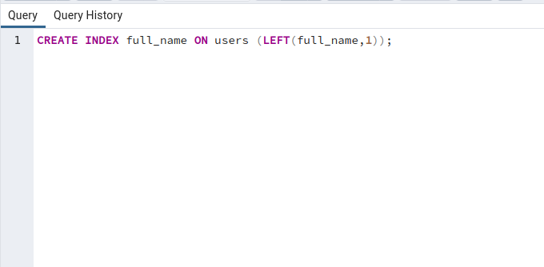
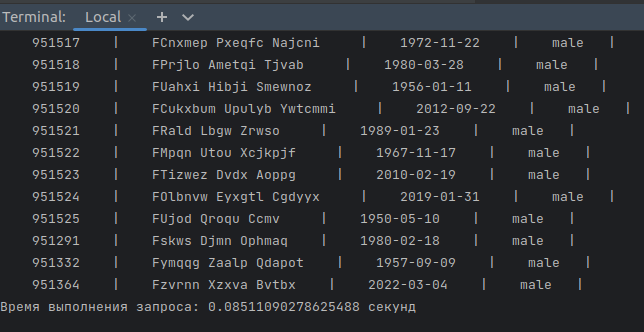
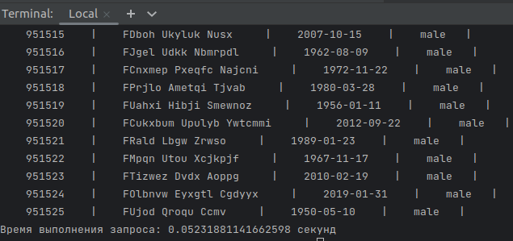

# ptmk_test_task

# Инструкция по запуску
После клонирования репозитория выполните следующие команды (не забудьте активировать виртуальное окружение):

1. `pip install -r requirements`

2. `export DB_NAME= # Имя БД`

   `export USER= # Пользователь БД`

   `export PASSWORD= # Пароль пользователя БД`

3. `python3 main.py 1` с указанием номера функции (1,2,3,4,5)

### Задание 6
Оптимизировал запрос с помощью установки индексов на 1 букву ФИО

До установки индексов

После установки индексов

